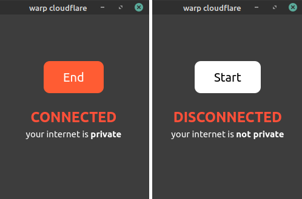

# warp cloudflare gui

a gui app depend on warp-cli

### Installation
read [warp-cli install doc](https://developers.cloudflare.com/warp-client/setting-up/linux).
install `warp-cli` and register with `$ warp-cli register`.

clone this repo and run `main.py`.

### Screenshot

